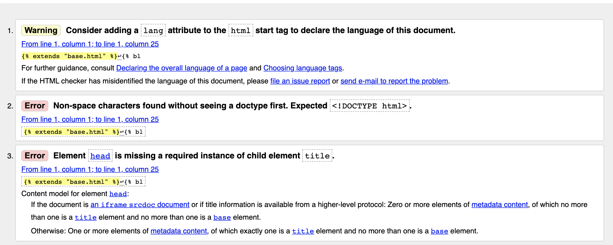
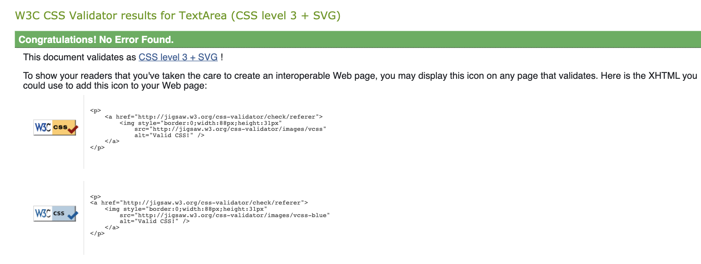
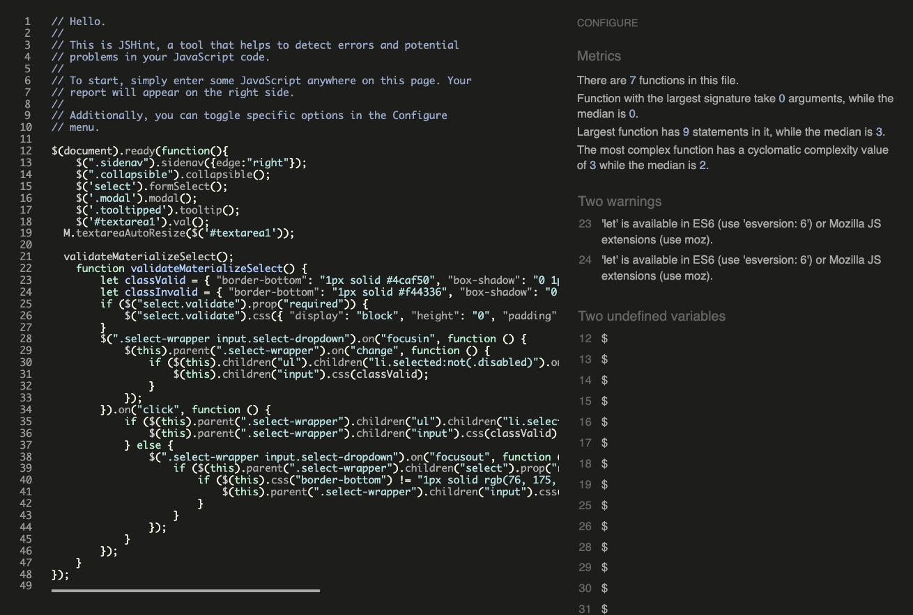
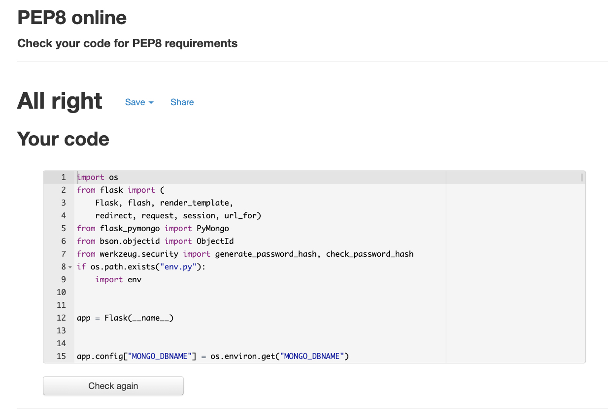

# 
Testing [Laugh Out Loud!](https://jokes-library.herokuapp.com/)

### [Back to repository](https://github.com/karzuin/jokes_library_MS3)

## Table of Contents

* [Validators](#validators)
* [Testing User Stories](#testing-user-stories)
* [Responsiveness On Different Devices](#responsiveness-on-different-devices)
* [Browser Compatibility](#browser-compatibility)
* [Bugs During Testing](#bugs-during-testing)
* [Bugs To Be Fixed](#bugs-to-be-fixed)

## Validators

Used [W3C HTML validator](https://validator.w3.org/#validate_by_input) website via the direct input path. 

1. Index.html validator results. Due to the jinja templating it throws errors for the majority of the code.

Used [Jigsaw](https://jigsaw.w3.org/css-validator/#validate_by_input) website via the direct input path. 

2. Style.css validator results.

Used[JShint](https://jshint.com/) website.
3. main.js validator results.

Used [PEP8](http://pep8online.com/).
4. app.py validator results.

[Back to top](#table-of-contents)

## Testing User Stories

#### All Users

- As a user, I want the website to be easy to understand and navigate.
    - As the user can see from the homepage everything is clearly described and labelled. 
    - The fixed navbar on the top shows the tabs to the Home, Register and Log In pages.

- As a user, I want the website to be clean and simple looking.
    - The user can see that the layout is very simple, clean and spacious looking.

- As a user, I want to be able to read jokes on the homepage.
    - The user can scroll down and immediately see the joke cards
- As a user, I want to be able to access different categories of jokes easily from the homepage.
- As a user, I want to be able to search for jokes.
- As a user, I want to be able to like and dislike each joke and see the number count.
- As a user, I want to be able to register easily and have that confirmed.

#### Registered Users

- As a user, I want to be able to log in easily and have that confirmed.
- As a user, I want to be able to submit my own jokes easily and have that confirmed.
- As a user, I want to be able to edit my jokes and have that confirmed.
- As a user, I want to be able to bookmark jokes from other users I like and have that confirmed.
- As a user, I want to be able to un-bookmark jokes on the collections page, home page and category page and have that confirmed.
- As a user, I want to be able to see the bookmarked jokes in my collections.

[Back to top](#table-of-contents)

## Responsiveness On Different Devices

### 

In desktop mode, 

In iPad mode, 

In mobile phone mode, 

[Back to top](#table-of-contents)

# Browser Compatibility

[Google Chrome](https://google.com) all the testing information has been tested on Chrome browser using DevTools.

[Mozilla Firefox](https://www.mozilla.org/en-GB/firefox/new/)
- **Bug**: 

[Internet Explorer](https://www.microsoft.com/en-gb/download/internet-explorer.aspx) 
- **Bug**: 

[Safari](https://www.apple.com/uk/safari/) 

[Back to top](#table-of-contents)

## Bugs During Testing

- **Bug**: 
- **Debugged**: 

- **Bug**: 
- **Debugged**: 

- **Bug**:
- **Debugged**: 

- **Bug**: 
- **Debugged**: 

## Bugs to be fixed

- **Bug**: 
- **Bug**: 

[Back to top](#table-of-contents)

### [Back to repository](https://github.com/karzuin/jokes_library_MS3)